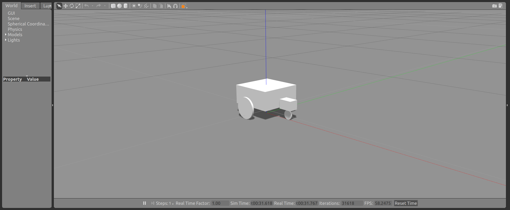

# sddr_ws
simple differential drive robot - ROS

## Environment

##### ROS version: /opt/ros/kinetic/

Install Dependences:
```
sudo apt-get install ros-kinetic-desktop-full

sudo apt-get install ros-kinetic-turtlebot-gazebo 

sudo apt-get install ros-kinetic-turtlebot-teleop

rosdep update
```

Check env:
```
printenv | grep ROS
```
> ROS_ROOT=/opt/ros/kinetic/share/ros
ROS_PACKAGE_PATH=/home/weiyu/Dev/ROS/sddr_ws/src:/opt/ros/kinetic/share
ROS_MASTER_URI=http://127.0.0.1:11311
OLDPWD=/home/weiyu/Dev/ROS
LD_LIBRARY_PATH=/home/weiyu/Dev/ROS/sddr_ws/devel/lib:/opt/ros/kinetic/lib
PWD=/home/weiyu/Dev/ROS/sddr_ws
ROS_HOSTNAME=localhost
ROSLISP_PACKAGE_DIRECTORIES=/home/weiyu/Dev/ROS/sddr_ws/devel/share/common-lisp
ROS_DISTRO=kinetic
ROS_IP=127.0.0.1
CMAKE_PREFIX_PATH=/home/weiyu/Dev/ROS/sddr_ws/devel:/opt/ros/kinetic
ROS_ETC_DIR=/opt/ros/kinetic/etc/ros


## Get it to demo

1. In /sddr_ws, source to work space
```
source devel/setup.bash
```

2. build packages
```
cd /sddr_ws

catkin_make
```

3. launch robot model in RViz
```
roslaunch simple_robot_description simple_robot.launch 
```

4. launch robot model in Gazebo
```
roslaunch simple_robot_demo gazebo.launch
```

#### Control it

  * It is controllable with keyboard.

  


  * You can open a new terminal to monitor teleop topic

  ```
  rostopic echo /cmd_vel_mux/input/teleop 
  ```

  * run square mode (square length is configurable by changing square_side_length = 1)
  ```
  rosrun simple_robot_demo square_pub.py

  ```

  * circle mode
  ```
  rostopic pub /cmd_vel_mux/input/teleop geometry_msgs/Twist -r 10 '[10, 0, 0]' '[0, 0, 5]'

  ```

## How does it looks like in RViz and Gazebo

#### In RViz


#### In Gazebo


##### However, it has been first degisened as below.
(I remodeled it for kinematics concerns - to make the movement smoother.)




